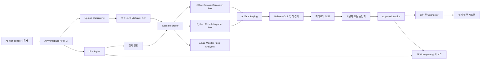

# AI Workspace 격리형 Sandbox Azure 권장 아키텍처

## 목차

| 절 | 내용 |
| --- | --- |
| [1. 목적](#1-목적) | 문서 범위 |
| [2. 요구사항과 권장 대응](#2-요구사항과-권장-대응) | 고객 요건별 Azure 대응 |
| [3. 권장 논리 아키텍처](#3-권장-논리-아키텍처) | 전체 흐름도 |
| [4. 핵심 구성요소](#4-핵심-구성요소) | Agent, 정책 엔진, Broker, 두 pool, Staging |
| [5. Trust Boundary와 위협 모델](#5-trust-boundary와-위협-모델) | 경계별 통제 |
| [6. 인증과 권한](#6-인증과-권한) | RBAC와 identity 분리 |
| [7. 네트워크](#7-네트워크) | egress 정책 |
| [8. 파일과 데이터 lifecycle](#8-파일과-데이터-lifecycle) | 업로드부터 삭제까지 |
| [9. 실행, 오류 수정과 재시도](#9-실행-오류-수정과-재시도) | LLM 재시도 루프 |
| [10. Session 및 리소스 운영](#10-session-및-리소스-운영) | identifier, lifecycle, capacity, image, **비용** |
| [11. 모니터링과 감사](#11-모니터링과-감사) | 로그, metric, SLO, 경보 |
| [12. 주요 제약사항](#12-주요-제약사항) | 실측 한도 |
| [13. 대안 비교](#13-대안-비교) | Dynamic Sessions vs ACI vs AKS vs Functions |
| [14. 운영 사례](#14-운영-사례) | 시나리오별 처리 |
| [15. 도입 단계](#15-도입-단계) | PoC에서 production까지 |
| [16. Production 전 체크리스트](#16-production-전-체크리스트) | 배포 전 확인 |
| [17. 공식 참고 자료](#17-공식-참고-자료) | Learn 링크 |

관련 실습:

- [실습 1: Python Code Interpreter와 LLM](../labs/01_Python_Code_Interpreter_Lab.md)
- [실습 2: Office Custom Container](../labs/02_Office_Custom_Container_Lab.md)

## 1. 목적

AI Workspace의 LLM과 Agent가 사용자의 자연어 요청을 분석하고 코드 또는 문서 생성 계획을 만든 뒤, Azure Container Apps Dynamic Sessions에서 신뢰할 수 없는 코드와 파일을 격리 실행하는 구조를 정의한다.

목표는 Sandbox가 실제 업무 시스템을 직접 변경하지 못하게 하고, 만족스러운 산출물만 검사·미리보기·사용자 승인을 거쳐 승인된 Connector로 승격하는 것이다.

## 2. 요구사항과 권장 대응

| AI Workspace 요구사항 | Azure 권장 대응 | 검증 위치 |
| --- | --- | --- |
| Python 코드 생성·실행 | Python Code Interpreter session pool | [실습 1B §3](../labs/01B_Python_Code_Interpreter_User_Lab.md#3-실제-llm에-자연어-요청) |
| 오류 수정과 재실행 | 제한된 `stdout`·`stderr`, 코드 hash와 재시도 정책 | [실습 1A §13.2](../labs/01A_Python_Code_Interpreter_Admin_Lab.md#132-오류-발생-코드-수정-재실행), [실습 1B §5](../labs/01B_Python_Code_Interpreter_User_Lab.md#5-오류-복구와-정책-거부) |
| 분석·계산·차트·파일 생성 | Code Interpreter의 `/mnt/data`와 격리된 artifact staging | [실습 1A §9~12](../labs/01A_Python_Code_Interpreter_Admin_Lab.md#9-샘플-csv와-분석-코드) |
| 첨부파일 분석·가공 | 업로드 전 형식·크기·malware 검사 후 session에 복사 | [실습 1B §2~3](../labs/01B_Python_Code_Interpreter_User_Lab.md#2-첨부파일-준비) |
| Office 문서 생성 | Python pool 또는 Custom Container | [실습 2B §2](../labs/02B_Office_Custom_Container_User_Lab.md#2-생성-요청) |
| Office 문서 변환 | 허용 matrix 기반 LibreOffice·Pandoc 변환 | [실습 2B §3](../labs/02B_Office_Custom_Container_User_Lab.md#3-변환-요청) |
| Office 문서 편집 | 선언적 operation 허용 목록 | [실습 2B §4](../labs/02B_Office_Custom_Container_User_Lab.md#4-선언적-편집-요청) |
| 작업별 독립 환경 | 암호학적으로 생성한 요청 또는 대화 단위 identifier | [실습 1A §13.1](../labs/01A_Python_Code_Interpreter_Admin_Lab.md#131-세션-간-격리-확인) |
| 실행 시간·CPU·메모리 제한 | 플랫폼 강제 한도와 정책 엔진 사전 분류 | [실습 1A §13.3](../labs/01A_Python_Code_Interpreter_Admin_Lab.md#133-실행-시간과-메모리-한도) |
| 네트워크 접근 제한 | `EgressDisabled` pool 속성 | [실습 1A §13](../labs/01A_Python_Code_Interpreter_Admin_Lab.md#13-egress-차단-확인) |
| 허용 명령어 제한 | 정책 엔진과 Office 작업 API. 4.4.1절 참고 | [실습 1B §5](../labs/01B_Python_Code_Interpreter_User_Lab.md#5-오류-복구와-정책-거부), [실습 2B §4](../labs/02B_Office_Custom_Container_User_Lab.md#4-선언적-편집-요청) |
| 임시 파일 자동 정리 | Timed lifecycle, cooldown, 명시적 stop/delete API | [실습 1A §14.1](../labs/01A_Python_Code_Interpreter_Admin_Lab.md#141-session-종료와-임시-파일-자동-정리) |
| 승인 후 실제 반영 | Sandbox와 분리된 Approval Service 및 최소 권한 Connector | [실습 1B §4](../labs/01B_Python_Code_Interpreter_User_Lab.md#4-결과-검토와-승인) |

## 3. 권장 논리 아키텍처



## 4. 핵심 구성요소

### 4.1 AI Workspace Agent

- 사용자 의도를 구조화된 작업 계획으로 변환한다.
- 실행할 코드를 생성하되 pool, network, resource limit을 직접 결정하지 않는다.
- 오류가 발생하면 정책 엔진이 허용한 정보와 횟수 안에서만 코드를 수정한다.
- token, session endpoint, 운영 credential을 prompt나 사용자 응답에 포함하지 않는다.

### 4.2 정책 엔진

LLM의 판단과 별도로 결정론적인 정책을 적용한다.

| 분류 | 조건 | 실행 경로 | 기본 결정 |
| --- | --- | --- | --- |
| A | Python 분석·계산, 220초 이하, 128MB 이하, 외부 통신 불필요 | Python pool | 허용 |
| B | DOCX·XLSX·PPTX·PDF 생성 또는 변환 | Office pool | 허용된 API만 호출 |
| C | 220초 초과, 128MB 초과, 대량 batch | 별도 비동기 compute | session pool에서 거부 |
| D | 인터넷 접근 필요 | 통제 egress pool | 승인 대기 |
| E | 관리자 명령, 운영 시스템 직접 변경 | 실행하지 않음 | 거부 |

정책 입력에는 tenant, 사용자, 작업 유형, 파일 metadata, 예상 시간, 필요한 도구, network 요구, 데이터 분류를 포함한다.

### 4.3 Session Broker

- AI Workspace 백엔드의 Managed Identity로 Entra token을 발급한다.
- pool별 management endpoint와 API version을 서버에서 관리한다.
- 사용자 입력과 분리된 예측 불가능한 session identifier를 생성한다.
- `tenant_id`, `user_id`, `conversation_id`, `request_id`, identifier를 서버 내부에서 매핑한다.
- tenant별 동시성, 실행 횟수, timeout, artifact 크기를 제한한다.
- 모든 요청에 correlation ID를 부여한다.

### 4.4 Python Code Interpreter pool

- 범용 Python 분석과 LLM 생성 코드 실행에 사용한다.
- 플랫폼 제공 interpreter와 파일 API를 사용한다.
- 기본 network는 `EgressDisabled`로 설정한다.
- 실행 출력은 API 응답에서 수집한다. Code Interpreter 출력은 Custom Container의 session console Log Analytics 테이블과 동일하게 제공되지 않는다.

2026-07-25 한국 중부 `PythonLTS` pool에서 확인한 사전 설치 라이브러리다. `EgressDisabled`에서는 `pip install`을 할 수 없으므로 이 목록이 곧 사용 가능한 기능의 범위다.

| 분류 | 라이브러리 |
| --- | --- |
| 런타임 | Python 3.12.7 |
| 데이터 | pandas 2.2.2, numpy 1.26.4, pyarrow 16.1.0 |
| 분석 | scipy 1.13.1, scikit-learn 1.5.1, statsmodels 0.14.6, sympy 1.14.0, networkx 3.3 |
| 시각화 | matplotlib 3.8.4, seaborn 0.13.2 |
| 문서 | openpyxl 3.1.5, python-docx 1.2.0, python-pptx 1.0.2, XlsxWriter 3.2.9, reportlab 4.4.6 |
| 기타 | Pillow 11.3.0, lxml 6.1.1, beautifulsoup4 4.12.3, tabulate 0.9.0 |

중요한 설계 시사점이다.

- **DOCX·XLSX·PPTX 단순 생성은 Python pool만으로 가능하다.** Custom Container가 반드시 필요한 것은 아니다.
- Custom Container는 **LibreOffice·Pandoc·Poppler 기반 변환, CJK 폰트, 도구 버전 고정**이 필요할 때 쓴다.
- 이 목록은 플랫폼 image 갱신에 따라 변한다. 버전을 고정해야 하는 워크로드는 Custom Container로 옮긴다.
- 배포 파이프라인에 라이브러리 목록 확인을 회귀 테스트로 넣는다.

### 4.4.1 "허용 명령어 제한"을 실제로 어떻게 달성하는가

자주 오해가 생기는 지점이라 명시한다.

**Code Interpreter session 안에서는 `subprocess`, `os.system` 같은 shell 실행이 원래 가능하다.** LLM이 생성한 코드를 정적으로 검사해 이를 막을 수는 있지만, 문자열 난독화나 동적 import로 우회할 수 있으므로 이것을 주 방어선으로 삼으면 안 된다.

따라서 통제는 "sandbox **안에서** 무엇을 못 하게 하느냐"가 아니라 **"sandbox가 **밖으로** 무엇을 할 수 있느냐"** 로 설계한다.

| 계층 | 통제 | 우회 가능성 |
| --- | --- | --- |
| 정책 엔진의 요청 분류 | 위험 요청을 session 할당 전에 거부 | 낮음. LLM 밖에서 결정론적으로 동작 |
| 생성 코드 pattern 검사 | 명백한 위반을 조기 차단 | **높음. 보조 수단으로만 취급** |
| Hyper-V session 격리 | 호스트와 다른 session 침범 불가 | 매우 낮음 |
| `EgressDisabled` | 외부 통신·유출 차단 | 매우 낮음 |
| 실행 시간·메모리 한도 | 자원 고갈 방지 | 매우 낮음 |
| credential 미주입 | session 안에 훔칠 것이 없음 | 매우 낮음 |
| 승인 게이트 | 산출물이 승인 없이 업무 시스템에 도달 불가 | 매우 낮음 |

Office pool은 사정이 다르다. Custom Container는 우리가 만든 image이므로 **애초에 shell을 노출하지 않는 제한된 HTTP API만** 제공한다. 4.7절의 job API가 그 계약이다.

정리하면, Python pool은 "안에서 무엇이든 할 수 있지만 밖으로는 아무것도 못 한다"로, Office pool은 "허용된 operation만 호출할 수 있다"로 통제한다.

### 4.5 Office Custom Container pool

- LibreOffice, Pandoc, Poppler, 폰트를 image에 고정한다.
- XLSX와 PPTX 생성에 사용하는 library도 version을 고정하고 image digest와 함께 기록한다.
- 임의 shell 대신 `/health`, `/generate`, `/files/...` 같은 제한된 HTTP API만 제공한다.
- 비루트 사용자로 실행한다.
- Startup과 Liveness probe를 구성한다.
- ACR image pull에는 전용 user-assigned Managed Identity와 `AcrPull`만 부여한다.
- runtime resource access identity는 기본적으로 노출하지 않는다.
- 기본 network는 `EgressDisabled`다.

### 4.6 Artifact Staging과 Approval Service

Sandbox는 실제 저장소에 쓰지 않는다.

1. 결과 파일을 격리된 staging 위치에 기록한다.
2. 파일 확장자뿐 아니라 magic bytes와 실제 MIME type을 확인한다.
3. malware, DLP, macro, archive bomb, size 검사를 수행한다.
4. 문서 미리보기와 이전 버전 Diff를 생성한다.
5. 사용자 또는 권한 있는 승인자가 명시적으로 승인한다.
6. Approval Service가 artifact hash를 다시 확인한다.
7. 최소 권한 Connector가 최종 위치에 복사한다.

### 4.7 Office 작업 API

Custom Container가 임의 command와 shell argument를 받게 하지 않는다. AI Workspace가 호출할 수 있는 작업을 선언적 schema로 제한한다.

| API 예시 | 목적 |
| --- | --- |
| `POST /jobs` | job 생성과 입력 metadata 등록 |
| `POST /jobs/{id}/inputs` | 검사된 입력 파일 업로드 |
| `POST /jobs/{id}/generate` | DOCX, XLSX, PPTX, PDF 생성 |
| `POST /jobs/{id}/convert` | 허용된 source-target 조합 변환 |
| `POST /jobs/{id}/edit` | 선언적 편집 operation 적용 |
| `GET /jobs/{id}` | 상태와 오류 조회 |
| `GET /jobs/{id}/files/{name}` | 결과 다운로드 |

이 repository의 reference container는 위 계약의 축약형을 구현했고 실습 2에서 검증한다.

| 구현된 endpoint | 통제 |
| --- | --- |
| `GET /health` | 도구 버전과 **허용 operation 목록**을 계약으로 노출 |
| `POST /generate` | 제목과 본문만 받아 네 형식 생성 |
| `POST /convert` | 고정된 source-target matrix에 있는 조합만 수행 |
| `POST /edit` | 허용 목록에 있는 선언적 operation만 적용 |
| `GET /files/{job}/{name}` | 허용된 파일 이름만 streaming 전달 |

허용할 편집 operation 예:

- DOCX: text placeholder 교체, section 추가, metadata 제거
- XLSX: 지정 range 값·수식 입력, chart 생성, sheet 이름 변경
- PPTX: placeholder 교체, slide 추가, image 배치
- PDF: Office 원본에서 재생성, 페이지 병합·분할처럼 명시적으로 허용된 작업

금지 항목:

- 임의 executable, shell command, LibreOffice command-line argument
- macro 실행 또는 보존
- external template와 remote image 자동 다운로드
- 임의 local path 읽기
- 허용 목록 밖의 source-target 변환

이 repository의 `/generate`, `/convert`, `/edit` API는 격리, image, probe와 결과 검증을 설명하기 위한 최소 reference implementation이다. Production AI Workspace에서는 위 job API 전체와 입력 검사·승인 경계를 추가한다.

### 4.8 Agent 오케스트레이션 계층

Sandbox만으로는 요건이 충족되지 않는다. 자연어 요청을 받아 정책을 적용하고 코드를 만들고 결과를 승격하는 계층이 필요하다.

```text
사용자 요청
  -> 정책 엔진 (LLM 호출 전에 결정)
  -> LLM 계획·코드 생성
  -> 생성 코드 검사 (실행 전)
  -> 격리 session 실행
  -> 실패 시 sanitize된 오류 -> 코드 수정 -> 재실행 (최대 2회)
  -> 산출물 회수, 형식·macro·hash 검사
  -> Artifact Staging
  -> 미리보기와 Diff
  -> 사용자 승인
  -> hash 재검증 후 Connector 승격
  -> session 삭제
```

이 repository의 `agent/` package가 각 단계의 reference 구현이다.

| 모듈 | 대응 구성요소 |
| --- | --- |
| `agent/policy.py` | 4.2 정책 엔진 |
| `agent/broker.py` | 4.3 Session Broker |
| `agent/llm.py` | 4.1 AI Workspace Agent |
| `agent/staging.py` | 4.6 Artifact Staging과 Approval Service |
| `agent/orchestrator.py` | 9절 실행과 재시도 루프 |

호출 순서에서 중요한 설계 결정이다.

1. **정책 엔진이 LLM보다 먼저 실행된다.** 거부된 요청은 LLM 비용도 session 비용도 발생시키지 않는다.
2. **생성 코드 검사가 실행보다 먼저 실행된다.** 다만 4.4.1절대로 이는 보조 수단이다.
3. **session 삭제는 성공·실패와 무관하게 항상 실행된다.**
4. **승인 없이는 승격이 없다.** 기본값이 "승격하지 않음"이어야 한다.
5. **hash는 staging 시점과 승격 직전 두 번 계산한다.**
6. **session identifier는 감사 로그에만 남고 사용자 응답에는 넣지 않는다.**

LLM에는 session identifier, access token, pool endpoint, production credential, 다른 tenant 데이터를 전달하지 않는다.

### 4.8.1 추론 모델 사용 시 주의

2026-07 기준 gpt-5.x 계열 추론 모델은 기존 chat 모델과 호출 규약이 다르다. 한국 중부 `gpt-5.6-terra` 실측이다.

| 항목 | 내용 |
| --- | --- |
| 출력 토큰 파라미터 | `max_tokens` 거부. `max_completion_tokens` 사용 |
| `temperature` | 기본값 1 외 거부 |
| `reasoning_effort` | `low`·`medium`·`high` 등 지원. **요청 파라미터이지 배포 설정이 아니다** |
| 출력 한도 소비 | 추론 토큰도 한도를 소비하므로 넉넉히 설정 |

Broker나 LLM client는 두 규약을 모두 처리하도록 만들고, `unsupported_parameter` 응답에 대해 한 번만 fallback 재시도한다.

또한 **실행 성공 판정을 `stderr`가 비었는지로 하면 안 된다.** 정상 동작하는 코드도 경고를 `stderr`로 출력한다. 플랫폼이 돌려주는 `status`만 신뢰하고 `stderr`는 참고 정보로 다룬다. 이를 어기면 성공한 코드를 반복 재시도해 재시도 한도와 비용을 소진한다.

검증 절차는 [실습 1B](../labs/01B_Python_Code_Interpreter_User_Lab.md)에 있다.

## 5. Trust Boundary와 위협 모델

| 경계 또는 위협 | 통제 |
| --- | --- |
| 사용자 입력과 AI Workspace | 인증, tenant binding, 요청 크기 제한, prompt injection 방어 |
| AI Workspace와 session endpoint | Managed Identity, HTTPS, Session Executor RBAC |
| identifier 탈취 | backend-only 생성·저장, URL·browser·client log 비노출 |
| 악성 코드 | Hyper-V 격리 session, timeout, CPU·memory limit, egress 차단 |
| 악성 첨부파일 | quarantine, malware 검사, archive depth·압축률 제한 |
| session 내부 credential 탈취 | production secret 미주입, runtime MI 비노출 |
| tenant 간 파일 접근 | tenant별 identifier mapping과 authorization check |
| 결과물 변조 | SHA-256, immutable staging, 승인 직전 hash 재검증 |
| 승인 우회 | Approval Service만 Connector 호출 가능 |
| 공급망 공격 | ACR private image, digest 기록, vulnerability scan, 고유 tag |
| 비용 고갈 | tenant별 concurrency, max sessions, request quota, circuit breaker |

## 6. 인증과 권한

### 6.1 AI Workspace 백엔드

- pool management API 호출 identity에 `Azure ContainerApps Session Executor`를 pool 범위로 부여한다.
- Resource Manager에서 pool을 생성·수정하는 배포 identity와 runtime 호출 identity를 분리한다.
- token audience는 `https://dynamicsessions.io`다.
- token을 browser, 사용자, Agent prompt 또는 application log에 기록하지 않는다.

### 6.2 Office image pull

- ACR admin user를 비활성화한다.
- user-assigned Managed Identity에 ACR 범위 `AcrPull`만 부여한다.
- registry identity는 image pull에만 사용하고 session runtime에서는 사용할 수 없게 유지한다.

### 6.3 Connector

- 업무 시스템별 별도 identity를 사용한다.
- create/update/read 권한을 업무별로 분리한다.
- Sandbox와 Agent에는 Connector credential을 제공하지 않는다.

## 7. 네트워크

### 기본 pool

- `EgressDisabled`
- package download, 임의 URL, webhook 호출을 허용하지 않는다.
- Python dependency와 Office binary는 image 또는 platform runtime에 포함한다.

### 통제 egress가 필요한 경우

기본 pool을 수정하지 않고 별도 pool을 만든다.

- VNet 통합
- UDR과 Azure Firewall
- FQDN 또는 목적지 allowlist
- DNS query와 egress traffic logging
- 승인자, 허용 목적지, 만료 시각, request ID 기록
- private endpoint가 가능한 Azure 서비스는 public endpoint 대신 private access 사용

## 8. 파일과 데이터 lifecycle

| 단계 | 위치 | 정책 |
| --- | --- | --- |
| 업로드 | Quarantine | 형식·크기·malware 검사 전 사용 금지 |
| 실행 입력 | Session 임시 파일 공간 | 해당 identifier에서만 접근 |
| 실행 결과 | Session 임시 공간 | 최종 저장소가 아님 |
| 검사용 결과 | Artifact Staging | hash, TTL, tenant prefix, immutable metadata |
| 승인 결과 | 최종 업무 저장소 | Approval Service만 기록 |
| 종료 | Session 및 staging | lifecycle과 보존 정책에 따라 삭제 |

- 파일 이름을 신뢰하지 않고 서버가 안전한 이름을 생성한다.
- archive는 entry 수, depth, 압축 해제 크기와 압축률을 제한한다.
- Office macro, embedded object, external link는 기본 거부한다.
- 원본 파일과 생성 파일의 hash를 모두 기록한다.

## 9. 실행, 오류 수정과 재시도

1. Agent가 계획과 코드를 생성한다.
2. 정책 엔진이 library, command, 예상 실행 시간과 network 요구를 검사한다.
3. Broker가 실행하고 `stdout`, `stderr`, 상태, 실행 시간을 수집한다.
4. 실패하면 비밀 정보와 다른 tenant 데이터가 제거된 오류만 Agent에 전달한다.
5. Agent가 코드를 수정한다.
6. 코드 hash가 바뀐 경우에만 재실행한다.
7. 재실행은 기본 2회로 제한한다.
8. 동일 오류 반복, timeout, policy violation이면 중단한다.

재시도는 HTTP transport retry와 Agent code retry를 분리한다. 429·일시적 5xx는 지수 backoff를 적용하고, 코드 오류는 자동 network retry로 숨기지 않는다.

## 10. Session 및 리소스 운영

### 10.1 Identifier

- 128-bit 이상의 난수를 사용한다.
- 사용자 ID나 순번을 직접 사용하지 않는다.
- tenant와 identifier 매핑은 서버 저장소에서 authorization check와 함께 관리한다.

### 10.2 Lifecycle

- 일반 작업은 `Timed` lifecycle을 사용한다.
- Code Interpreter cooldown 허용 범위는 300~3600초다.
- 작업 완료 후 즉시 용량을 회수해야 하면 delete session API를 사용한다.
- Custom Container는 stop session management API를 사용한다.

### 10.3 Capacity

- `max-sessions`와 tenant별 concurrency를 별도로 제한한다.
- quota는 `az quota list`와 `az quota usage list`로 확인한다.
- Custom Container pool의 `ready-sessions`는 0을 허용하지 않을 수 있다. 2026-07-24 한국 중부 실제 검증에서는 최소 1이 필요했다.
- ready session은 cold start를 줄이지만 지속 비용을 발생시킨다.
- latency SLO와 비용을 함께 측정해 최소값부터 조정한다.

### 10.4 Image 운영

- 고유한 image tag를 사용한다.
- 배포 기록에는 image digest를 저장한다.
- image update 후 기존 session이 새 image로 자동 교체된다고 가정하지 않는다.
- CVE scan, SBOM, tool version, font version을 release artifact로 기록한다.
- LibreOffice 변환 회귀 테스트를 표준 문서 세트로 수행한다.
- Reference container도 session당 job 수, 입력 크기, 임시 저장공간과 job TTL을 제한한다.

### 10.5 비용 모델

Dynamic Sessions 과금은 **할당된 session의 vCPU·메모리 사용 시간** 기준이다. 실행 중이 아니어도 session이 살아 있으면 과금된다. 이 특성이 설계에 미치는 영향이 크다.

| 항목 | 과금 성격 | 통제 수단 |
| --- | --- | --- |
| Python pool session | 할당된 동안 사용량 과금 | cooldown 단축, 작업 후 즉시 delete session |
| Custom Container ready session | **상시 과금.** 요청이 없어도 유지 | `ready-sessions` 최소화 |
| Custom Container 실행 session | 할당된 동안 사용량 과금 | cooldown, stop session |
| Container Apps Environment | workload profile 구성에 따른 고정비 | 두 pool이 환경을 공유 |
| Azure Container Registry | SKU별 저장소 고정비 | Basic부터 시작 |
| Log Analytics | 수집량과 보존 기간 | 보존 기간, 샘플링, 테이블별 필터 |
| Azure OpenAI | 토큰 사용량 | 재시도 한도, prompt 크기 제한 |

비용을 좌우하는 세 가지 결정이다.

1. **`ready-sessions` 값.** Custom Container pool은 최소 1을 요구할 수 있다(2026-07-24 한국 중부 실측). ready session은 cold start를 없애주지만 24시간 과금된다. cold start 지연을 감수할 수 있으면 최솟값을 유지한다.
2. **cooldown 길이.** 허용 범위는 300~3600초다. 값이 크면 session 재사용률이 올라 응답이 빨라지지만 idle 과금이 늘어난다. 대화형 워크로드는 짧게, 연속 작업이 많으면 길게 잡는다.
3. **명시적 삭제 여부.** 작업이 끝났는데 cooldown을 기다리면 그 시간만큼 낭비다. Broker가 작업 완료 시 delete/stop API를 호출하면 회수 시간이 짧아진다.

권장 통제:

- tenant별 동시 session 수와 일일 실행 횟수에 상한을 둔다.
- `max-sessions`를 실제 필요량으로 제한해 폭주 시 비용 상한을 만든다.
- 비용 경보를 Resource Group 단위로 설정한다.
- `PoolReadyPodCount`와 실제 실행 수를 함께 보고 ready 수를 조정한다.
- 정책 분류 C·D·E에서 거부된 요청은 session을 할당하지 않으므로, 정책 엔진 자체가 비용 통제 수단이다.
- 실습·PoC 환경은 사용 후 Resource Group 단위로 삭제한다. pool만 지우면 Environment, ACR, Log Analytics 비용이 남는다.

정확한 단가는 리전과 시점에 따라 다르므로 [Container Apps 가격](https://azure.microsoft.com/pricing/details/container-apps/)과 Azure Pricing Calculator에서 확인한다. 설계 단계에서는 "ready session 수 x 24시간"을 고정비로, 나머지를 변동비로 잡고 시작한다.

## 11. 모니터링과 감사

### 11.1 Correlation

```text
tenant_id
  -> request_id
  -> agent_plan_id
  -> pool_name
  -> session_identifier
  -> execution_id 또는 job_id
  -> artifact_hash
  -> policy_decision
  -> approval_id
  -> connector_result
```

### 11.2 수집 항목

| 계층 | 수집 항목 |
| --- | --- |
| AI Workspace Agent | 요청 분류, plan ID, code hash, retry 횟수 |
| 정책 엔진 | 규칙 버전, 결정, 거부 사유, 예외 승인 |
| Session Broker | allocation latency, HTTP status, 실행 시간, timeout |
| Python pool | API 응답의 stdout, stderr, execution status, 생성 파일 |
| Office pool | stdout·stderr, probe, lifecycle, pool event |
| Artifact Service | MIME, size, SHA-256, malware·DLP 결과 |
| Approval Service | 승인자, 시각, hash, 대상, connector 결과 |

### 11.3 Custom Container Log Analytics

**수집 경로에 따라 테이블 이름이 다르다.** 2026-07-25 한국 중부 실측 결과다.

| 수집 방법 | 설정 대상 | 생성되는 테이블 |
| --- | --- | --- |
| `az containerapp env create --logs-destination log-analytics` | Environment 생성 시 | `AppEnvSessionConsoleLogs_CL` **하나뿐** |
| Azure Monitor 진단 설정 | **Environment** 리소스 | `AppEnvSessionConsoleLogs`, `AppEnvSessionLifecycleLogs`, `AppEnvSessionPoolEventLogs` |

주의할 점이다.

- **Environment 로그 대상 설정만으로는 lifecycle과 pool event 로그를 볼 수 없다.** console 로그만 들어온다. 나머지는 진단 설정이 필요하다.
- 진단 설정은 **session pool이 아니라 Environment** 리소스에 만든다. pool 리소스는 `AllMetrics`만 지원한다.
- 이 세 카테고리는 `logAnalyticsDestinationType`과 **무관하게 항상 resource-specific 테이블로 들어간다.** `null`(기본값)로 두어도 `AzureDiagnostics`가 아니라 위 테이블에 수집되는 것을 실측으로 확인했다.
- **진단 카테고리 이름과 테이블 이름의 대소문자가 다르다.**

| 진단 카테고리 | 실제 테이블 |
| --- | --- |
| `AppEnvSessionConsoleLogs` | `AppEnvSessionConsoleLogs` |
| `AppEnvSessionLifeCycleLogs` (대문자 C) | `AppEnvSessionLifecycleLogs` (소문자 c) |
| `AppEnvSessionPoolEventLogs` | `AppEnvSessionPoolEventLogs` |

- `AppEnvSessionPoolEvents`나 `*_CL` 접미사를 붙인 lifecycle·pool event 테이블은 **존재하지 않는다.** 잘못된 이름은 KQL `SemanticError`로 실패한다.
- 진단 설정 후 첫 수집까지 2~5분 걸린다.

```kusto
AppEnvSessionConsoleLogs_CL
| where TimeGenerated > ago(1h)
| order by TimeGenerated desc
| take 100
```

```kusto
AppEnvSessionLifecycleLogs
| where TimeGenerated > ago(1h)
| project TimeGenerated, SessionPoolName, OperationName, Log
| order by TimeGenerated desc
```

```kusto
AppEnvSessionPoolEventLogs
| where TimeGenerated > ago(1h)
| project TimeGenerated, SessionPoolName, OperationName, Log
| order by TimeGenerated desc
```

세 테이블의 주요 컬럼은 `TimeGenerated`, `SessionPoolName`, `OperationName`, `Log`, `Level`, `Location`, `NodeName`, `PodName`, `_ResourceId`로 동일하다.

어떤 테이블이 실제로 존재하는지 먼저 확인하는 것이 가장 빠른 진단이다.

```kusto
search *
| where TimeGenerated > ago(1h)
| summarize Records=count() by $table
```

설정 절차는 [실습 2A §15](../labs/02A_Office_Custom_Container_Admin_Lab.md#15-monitoring)에 있다.

### 11.4 Metrics와 SLO

Custom Container session pool 주요 metric:

- `PoolExecutingPodCount`
- `PoolPendingPodCount`
- `PoolReadyPodCount`

권장 SLO:

- pool allocation p50·p95·p99
- 실행 성공률과 timeout 비율
- session pending·ready·executing 수
- 429·5xx 비율
- artifact 검사 실패율
- Agent code retry 비율
- session cleanup 지연
- 승인율과 Connector 실패율

### 11.5 권장 경보

| 경보 | 조건 예시 | 의미 |
| --- | --- | --- |
| Pool 포화 | `PoolPendingPodCount`가 5분간 0보다 큼 | ready·max session 부족. 사용자 대기 발생 |
| Ready session 소실 | `PoolReadyPodCount`가 0 | cold start 급증. image pull 또는 probe 실패 의심 |
| 실행 실패율 급증 | 실패 비율이 기준선의 2배 | LLM 품질 저하 또는 플랫폼 이상 |
| Timeout 급증 | `Request timed out` 비율 상승 | 220초 한도에 걸리는 작업이 유입됨. 정책 분류 재검토 |
| 재시도 소진 급증 | retry 한도 도달 비율 상승 | prompt 또는 데이터 스키마 변경 의심 |
| Artifact 검사 실패 | 형식·macro 검사 실패 발생 | 공격 시도 또는 생성 로직 회귀 |
| 승인 우회 시도 | Approval Service를 거치지 않은 Connector 호출 | **즉시 조사 대상** |
| Hash 불일치 | 승격 직전 hash 재검증 실패 | staging 변조 가능성. 즉시 조사 |
| 비용 급증 | Resource Group 일일 비용이 기준 초과 | session 폭주 또는 정리 실패 |
| 정리 지연 | 예상보다 오래 살아있는 session 수 | delete 호출 누락 |

경보는 pool 단위가 아니라 tenant 단위로도 볼 수 있어야 한다. 한 tenant의 폭주가 전체 pool을 잠식하는 상황을 조기에 잡기 위해서다.

## 12. 주요 제약사항

| 제약 | 실측 동작 | 대응 |
| --- | --- | --- |
| Code Interpreter 실행당 최대 220초 | 221.5초에 `status: Failed`, `Request timed out waiting for code execution to complete` | 작업 분할 또는 별도 비동기 compute |
| 실행 메모리 한도 | 무한 할당 시 `status: Failed`, `Execution aborted` | 데이터 분할 처리, chunk 단위 집계 |
| 파일 업로드당 최대 128MB | 초과 시 HTTP 413 | 사전 검사, 분할 또는 staging |
| 실패해도 HTTP는 200 | 실행 실패가 `status`와 `result.stderr`에만 나타남 | 호출부가 HTTP 코드만 보지 말고 `status`를 반드시 확인 |
| Session은 영구 저장소가 아님 | 삭제 후 목록 비고 다운로드 404 | Artifact Staging으로 명시적 이동 |
| Preview API shape와 version 변경 | `properties` 래퍼 사용 시 `SessionPropertiesMissing` | version 고정, 실제 통합 테스트, canary |
| Built-in runtime library 제한 | 4.4절 목록이 사용 가능 범위 | dependency가 필요하면 Custom Container |
| EgressDisabled에서 package 설치 불가 | `pip install` 실패 | dependency를 image에 포함 |
| Python pool에서 shell 실행 가능 | `subprocess` 자체는 막히지 않음 | 4.4.1절대로 외부 영향 차단으로 통제 |
| Office 변환 fidelity | LibreOffice 렌더링 차이 | 표준 문서 회귀 테스트, font 고정 |
| Macro·embedded object 위험 | - | 기본 거부 또는 제거 |
| Custom ready session 비용 | ready sessions 최소 1 필요 (한국 중부 실측) | 최소 ready count, 사용량 관측 |
| Code Interpreter logging 차이 | console log 테이블 없음 | 실행 API 응답을 AI Workspace가 직접 보관 |
| Region·quota 차이 | - | 배포 전 quota와 실제 provisioning 검증 |

## 13. 대안 비교

Dynamic Sessions가 항상 정답은 아니다. 요건에 맞는 선택 근거를 정리한다.

| 기준 | Dynamic Sessions | Container Instances (ACI) | AKS | Azure Functions |
| --- | --- | --- | --- | --- |
| 신뢰할 수 없는 코드 격리 | **Hyper-V 세션 격리 기본 제공** | 컨테이너 격리. 하드닝 직접 구현 | 노드 공유. 격리 직접 설계 | 격리 보장 없음 |
| session 할당 지연 | 밀리초~초 (ready session 사용 시) | 수십 초 | 수 초~수십 초 | 밀리초 (cold start 있음) |
| 요청 단위 수명주기 | **API로 생성·삭제. 자동 정리 내장** | 직접 생성·삭제 관리 | 직접 관리 | 무상태 |
| 세션별 임시 파일 공간 | **`/mnt/data` 기본 제공** | 볼륨 직접 구성 | PVC 직접 구성 | 임시 저장만 |
| 실행 시간 한도 | 실행당 220초 | 제한 없음 | 제한 없음 | plan에 따라 다름 |
| 운영 부담 | 낮음 | 중간 | **높음** | 낮음 |
| custom 런타임 | Custom Container pool | 자유 | 자유 | custom handler |
| 적합한 경우 | **LLM 생성 코드의 대화형 실행** | 장시간 단발 배치 | 대규모 상시 워크로드 | 이벤트 기반 짧은 함수 |

이 고객 요건에서 Dynamic Sessions를 권장하는 이유다.

1. 요건이 "작업별 독립 세션과 임시 파일 저장공간"인데 이것이 플랫폼 기본 기능이다.
2. 요건이 "작업 완료 또는 세션 종료 시 자동 정리"인데 cooldown lifecycle이 이를 제공한다.
3. 요건이 "신뢰할 수 없는 AI 생성 코드 실행"인데 Hyper-V 격리가 기본이다.
4. 요건이 "네트워크 접근 제한"인데 `EgressDisabled`가 pool 속성이다.

다만 **220초를 초과하거나 128MB를 넘는 작업은 Dynamic Sessions로 처리하지 않는다.** 정책 분류 C가 그 경계이며, 이런 작업은 Container Apps Jobs나 Batch로 라우팅한다. 즉 두 경로를 함께 설계하는 것이 현실적인 구성이다.

## 14. 운영 사례

### 사례 A: CSV 분석

Python pool에서 CSV를 읽고 PNG와 JSON을 만든다. 결과는 staging에 두고 사용자가 승인하기 전에는 최종 report 저장소에 복사하지 않는다.

### 사례 B: Office 보고서

Office pool의 제한된 `/generate` API가 DOCX, PDF, PPTX와 XLSX를 만든다. Agent가 임의 shell을 호출하지 않고 문서 생성 schema만 전달한다.

### 사례 C: 코드 오류

없는 열 이름으로 실패하면 허용된 schema와 stderr만 Agent에 전달한다. 최대 2회 수정 후 실패하면 사용자에게 오류 요약을 반환한다.

### 사례 D: 외부 URL 요청

기본 pool에서는 차단한다. business justification과 승인자가 있는 경우에만 만료 시간이 설정된 통제 egress pool로 라우팅한다.

### 사례 E: 대형·장시간 작업

128MB 또는 220초를 초과할 가능성이 있으면 session pool에서 실행하지 않는다. batch, job 또는 별도 compute로 라우팅한다.

### 사례 F: 최종 반영

Approval Service가 staging hash와 승인 시점 hash를 비교하고, 일치할 때만 Connector를 호출한다. 모든 결과를 감사 로그에 기록한다.

## 15. 도입 단계

한 번에 전체를 구축하지 않는다. 각 단계가 끝날 때 검증 가능한 산출물을 남긴다.
Office 변환·편집, CJK 폰트 고정 또는 도구 버전 고정이 필요하지 않으면 단계 2를 건너뛰고 단계 3으로 진행한다.

| 단계 | 목표 | 산출물 | 이 repository의 대응 |
| --- | --- | --- | --- |
| 0. 타당성 확인 | 리전, quota, 격리·한도 실측 | 검증 기록 | [실습 1](../labs/01_Python_Code_Interpreter_Lab.md) |
| 1. 실행 경로 확립 | Python pool에서 분석·차트·파일 생성 | 동작하는 pool과 산출물 | `scripts/python-lab.sh` |
| 2. 문서 경로 확립 (선택) | Office 생성·변환·편집 | ACR image와 Custom pool | [실습 2](../labs/02_Office_Custom_Container_Lab.md) |
| 3. 오케스트레이션 | 정책, LLM, 재시도, 승인 게이트 | Agent 계층 | [실습 1B](../labs/01B_Python_Code_Interpreter_User_Lab.md) |
| 4. 보안 강화 | malware·DLP 검사, 승인 UI, Connector 최소 권한 | 검사 파이프라인 | 고객 구현 영역 |
| 5. 운영 준비 | 모니터링, 경보, 비용 통제, incident 절차 | SLO와 runbook | 11절, 10.5절 |
| 6. 확장 | 통제 egress pool, 비동기 compute 경로 | 분리된 pool | 7절, 13절 |

각 단계에서 미루면 안 되는 것:

- 단계 1부터 `EgressDisabled`를 기본값으로 둔다. 나중에 조이는 것은 어렵다.
- 단계 1부터 identifier를 backend에서만 생성한다.
- 단계 3의 승인 게이트를 단계 4로 미루지 않는다. 기본값이 "승격하지 않음"이어야 한다.
- 단계 5의 비용 경보를 PoC 단계부터 설정한다. ready session은 상시 과금이다.

## 16. Production 전 체크리스트

- [ ] 지원 리전과 quota 확인
- [ ] Python과 Office pool 분리
- [ ] 기본 pool `EgressDisabled`
- [ ] backend-only identifier와 token
- [ ] Session Executor 최소 범위 RBAC
- [ ] runtime identity 비노출
- [ ] ACR admin 비활성화와 AcrPull identity
- [ ] 비루트 Office container
- [ ] Startup·Liveness probe
- [ ] upload quarantine와 malware·DLP 검사
- [ ] artifact hash와 immutable staging
- [ ] 명시적 승인과 Connector 분리
- [ ] tenant별 concurrency와 retry limit
- [ ] Log Analytics와 correlation ID
- [ ] lifecycle cleanup과 비용 경보
- [ ] Preview API 통합·회귀 테스트
- [ ] incident response와 session 강제 종료 절차
- [ ] 사전 설치 라이브러리 목록 회귀 테스트
- [ ] 정책 엔진이 LLM보다 먼저 실행되는지 확인
- [ ] 승인 없는 승격이 불가능한지 테스트로 확인
- [ ] session identifier가 사용자 응답과 client log에 없는지 확인
- [ ] ready session 상시 비용과 경보 설정
- [ ] 220초·128MB 초과 요청의 대체 경로 확보

## 17. 공식 참고 자료

- [Dynamic Sessions 개요](https://learn.microsoft.com/azure/container-apps/sessions)
- [Dynamic Sessions 사용·보안·인증](https://learn.microsoft.com/azure/container-apps/sessions-usage)
- [Code Interpreter sessions](https://learn.microsoft.com/azure/container-apps/sessions-code-interpreter)
- [Custom Container sessions](https://learn.microsoft.com/azure/container-apps/sessions-custom-container)
- [Session pool 구성](https://learn.microsoft.com/azure/container-apps/session-pool)
- [Azure Quotas](https://learn.microsoft.com/azure/quotas/quotas-overview)
- [Container Apps 가격](https://azure.microsoft.com/pricing/details/container-apps/)
- [Azure OpenAI Entra 인증](https://learn.microsoft.com/azure/ai-services/openai/how-to/managed-identity)
- [Container Apps Jobs](https://learn.microsoft.com/azure/container-apps/jobs)
