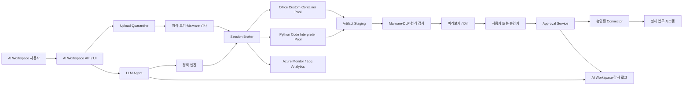

# AI Workspace 격리형 Sandbox Azure 권장 아키텍처

## 1. 목적

AI Workspace의 LLM과 Agent가 사용자의 자연어 요청을 분석하고 코드 또는 문서 생성 계획을 만든 뒤, Azure Container Apps Dynamic Sessions에서 신뢰할 수 없는 코드와 파일을 격리 실행하는 구조를 정의한다.

목표는 Sandbox가 실제 업무 시스템을 직접 변경하지 못하게 하고, 만족스러운 산출물만 검사·미리보기·사용자 승인을 거쳐 승인된 Connector로 승격하는 것이다.

## 2. 요구사항과 권장 대응

| AI Workspace 요구사항 | Azure 권장 대응 |
| --- | --- |
| Python 코드 생성·실행 | Python Code Interpreter session pool |
| 오류 수정과 재실행 | 제한된 `stdout`·`stderr`, 코드 hash와 재시도 정책 |
| 분석·계산·차트·파일 생성 | Code Interpreter의 `/mnt/data`와 격리된 artifact staging |
| 첨부파일 분석·가공 | 업로드 전 형식·크기·malware 검사 후 session에 복사 |
| Office 문서 생성·변환 | LibreOffice·Pandoc·Poppler를 고정한 Custom Container pool |
| 작업별 독립 환경 | 암호학적으로 생성한 요청 또는 대화 단위 identifier |
| 임시 파일 자동 정리 | Timed lifecycle, cooldown, 명시적 stop/delete API |
| 승인 후 실제 반영 | Sandbox와 분리된 Approval Service 및 최소 권한 Connector |

## 3. 권장 논리 아키텍처



## 4. 핵심 구성요소

### 4.1 AI Workspace Agent

- 사용자 의도를 구조화된 작업 계획으로 변환한다.
- 실행할 코드를 생성하되 pool, network, resource limit을 직접 결정하지 않는다.
- 오류가 발생하면 정책 엔진이 허용한 정보와 횟수 안에서만 코드를 수정한다.
- token, session endpoint, 운영 credential을 prompt나 사용자 응답에 포함하지 않는다.

### 4.2 정책 엔진

LLM의 판단과 별도로 결정론적인 정책을 적용한다.

| 분류 | 조건 | 실행 경로 | 기본 결정 |
| --- | --- | --- | --- |
| A | Python 분석·계산, 220초 이하, 128MB 이하, 외부 통신 불필요 | Python pool | 허용 |
| B | DOCX·XLSX·PPTX·PDF 생성 또는 변환 | Office pool | 허용된 API만 호출 |
| C | 220초 초과, 128MB 초과, 대량 batch | 별도 비동기 compute | session pool에서 거부 |
| D | 인터넷 접근 필요 | 통제 egress pool | 승인 대기 |
| E | 관리자 명령, 운영 시스템 직접 변경 | 실행하지 않음 | 거부 |

정책 입력에는 tenant, 사용자, 작업 유형, 파일 metadata, 예상 시간, 필요한 도구, network 요구, 데이터 분류를 포함한다.

### 4.3 Session Broker

- AI Workspace 백엔드의 Managed Identity로 Entra token을 발급한다.
- pool별 management endpoint와 API version을 서버에서 관리한다.
- 사용자 입력과 분리된 예측 불가능한 session identifier를 생성한다.
- `tenant_id`, `user_id`, `conversation_id`, `request_id`, identifier를 서버 내부에서 매핑한다.
- tenant별 동시성, 실행 횟수, timeout, artifact 크기를 제한한다.
- 모든 요청에 correlation ID를 부여한다.

### 4.4 Python Code Interpreter pool

- 범용 Python 분석과 LLM 생성 코드 실행에 사용한다.
- 플랫폼 제공 interpreter와 파일 API를 사용한다.
- 기본 network는 `EgressDisabled`로 설정한다.
- 실행 출력은 API 응답에서 수집한다. Code Interpreter 출력은 Custom Container의 session console Log Analytics 테이블과 동일하게 제공되지 않는다.

### 4.5 Office Custom Container pool

- LibreOffice, Pandoc, Poppler, 폰트를 image에 고정한다.
- XLSX와 PPTX 생성에 사용하는 library도 version을 고정하고 image digest와 함께 기록한다.
- 임의 shell 대신 `/health`, `/generate`, `/files/...` 같은 제한된 HTTP API만 제공한다.
- 비루트 사용자로 실행한다.
- Startup과 Liveness probe를 구성한다.
- ACR image pull에는 전용 user-assigned Managed Identity와 `AcrPull`만 부여한다.
- runtime resource access identity는 기본적으로 노출하지 않는다.
- 기본 network는 `EgressDisabled`다.

### 4.6 Artifact Staging과 Approval Service

Sandbox는 실제 저장소에 쓰지 않는다.

1. 결과 파일을 격리된 staging 위치에 기록한다.
2. 파일 확장자뿐 아니라 magic bytes와 실제 MIME type을 확인한다.
3. malware, DLP, macro, archive bomb, size 검사를 수행한다.
4. 문서 미리보기와 이전 버전 Diff를 생성한다.
5. 사용자 또는 권한 있는 승인자가 명시적으로 승인한다.
6. Approval Service가 artifact hash를 다시 확인한다.
7. 최소 권한 Connector가 최종 위치에 복사한다.

### 4.7 Office 작업 API

Custom Container가 임의 command와 shell argument를 받게 하지 않는다. AI Workspace가 호출할 수 있는 작업을 선언적 schema로 제한한다.

| API 예시 | 목적 |
| --- | --- |
| `POST /jobs` | job 생성과 입력 metadata 등록 |
| `POST /jobs/{id}/inputs` | 검사된 입력 파일 업로드 |
| `POST /jobs/{id}/generate` | DOCX, XLSX, PPTX, PDF 생성 |
| `POST /jobs/{id}/convert` | 허용된 source-target 조합 변환 |
| `POST /jobs/{id}/edit` | 선언적 편집 operation 적용 |
| `GET /jobs/{id}` | 상태와 오류 조회 |
| `GET /jobs/{id}/files/{name}` | 결과 다운로드 |

허용할 편집 operation 예:

- DOCX: text placeholder 교체, section 추가, metadata 제거
- XLSX: 지정 range 값·수식 입력, chart 생성, sheet 이름 변경
- PPTX: placeholder 교체, slide 추가, image 배치
- PDF: Office 원본에서 재생성, 페이지 병합·분할처럼 명시적으로 허용된 작업

금지 항목:

- 임의 executable, shell command, LibreOffice command-line argument
- macro 실행 또는 보존
- external template와 remote image 자동 다운로드
- 임의 local path 읽기
- 허용 목록 밖의 source-target 변환

이 repository의 `/generate` API는 격리, image, probe와 결과 검증을 설명하기 위한 최소 reference implementation이다. Production AI Workspace에서는 위 job API와 입력 검사·승인 경계를 추가한다.

## 5. Trust Boundary와 위협 모델

| 경계 또는 위협 | 통제 |
| --- | --- |
| 사용자 입력과 AI Workspace | 인증, tenant binding, 요청 크기 제한, prompt injection 방어 |
| AI Workspace와 session endpoint | Managed Identity, HTTPS, Session Executor RBAC |
| identifier 탈취 | backend-only 생성·저장, URL·browser·client log 비노출 |
| 악성 코드 | Hyper-V 격리 session, timeout, CPU·memory limit, egress 차단 |
| 악성 첨부파일 | quarantine, malware 검사, archive depth·압축률 제한 |
| session 내부 credential 탈취 | production secret 미주입, runtime MI 비노출 |
| tenant 간 파일 접근 | tenant별 identifier mapping과 authorization check |
| 결과물 변조 | SHA-256, immutable staging, 승인 직전 hash 재검증 |
| 승인 우회 | Approval Service만 Connector 호출 가능 |
| 공급망 공격 | ACR private image, digest 기록, vulnerability scan, 고유 tag |
| 비용 고갈 | tenant별 concurrency, max sessions, request quota, circuit breaker |

## 6. 인증과 권한

### 6.1 AI Workspace 백엔드

- pool management API 호출 identity에 `Azure ContainerApps Session Executor`를 pool 범위로 부여한다.
- Resource Manager에서 pool을 생성·수정하는 배포 identity와 runtime 호출 identity를 분리한다.
- token audience는 `https://dynamicsessions.io`다.
- token을 browser, 사용자, Agent prompt 또는 application log에 기록하지 않는다.

### 6.2 Office image pull

- ACR admin user를 비활성화한다.
- user-assigned Managed Identity에 ACR 범위 `AcrPull`만 부여한다.
- registry identity는 image pull에만 사용하고 session runtime에서는 사용할 수 없게 유지한다.

### 6.3 Connector

- 업무 시스템별 별도 identity를 사용한다.
- create/update/read 권한을 업무별로 분리한다.
- Sandbox와 Agent에는 Connector credential을 제공하지 않는다.

## 7. 네트워크

### 기본 pool

- `EgressDisabled`
- package download, 임의 URL, webhook 호출을 허용하지 않는다.
- Python dependency와 Office binary는 image 또는 platform runtime에 포함한다.

### 통제 egress가 필요한 경우

기본 pool을 수정하지 않고 별도 pool을 만든다.

- VNet 통합
- UDR과 Azure Firewall
- FQDN 또는 목적지 allowlist
- DNS query와 egress traffic logging
- 승인자, 허용 목적지, 만료 시각, request ID 기록
- private endpoint가 가능한 Azure 서비스는 public endpoint 대신 private access 사용

## 8. 파일과 데이터 lifecycle

| 단계 | 위치 | 정책 |
| --- | --- | --- |
| 업로드 | Quarantine | 형식·크기·malware 검사 전 사용 금지 |
| 실행 입력 | Session 임시 파일 공간 | 해당 identifier에서만 접근 |
| 실행 결과 | Session 임시 공간 | 최종 저장소가 아님 |
| 검사용 결과 | Artifact Staging | hash, TTL, tenant prefix, immutable metadata |
| 승인 결과 | 최종 업무 저장소 | Approval Service만 기록 |
| 종료 | Session 및 staging | lifecycle과 보존 정책에 따라 삭제 |

- 파일 이름을 신뢰하지 않고 서버가 안전한 이름을 생성한다.
- archive는 entry 수, depth, 압축 해제 크기와 압축률을 제한한다.
- Office macro, embedded object, external link는 기본 거부한다.
- 원본 파일과 생성 파일의 hash를 모두 기록한다.

## 9. 실행, 오류 수정과 재시도

1. Agent가 계획과 코드를 생성한다.
2. 정책 엔진이 library, command, 예상 실행 시간과 network 요구를 검사한다.
3. Broker가 실행하고 `stdout`, `stderr`, 상태, 실행 시간을 수집한다.
4. 실패하면 비밀 정보와 다른 tenant 데이터가 제거된 오류만 Agent에 전달한다.
5. Agent가 코드를 수정한다.
6. 코드 hash가 바뀐 경우에만 재실행한다.
7. 재실행은 기본 2회로 제한한다.
8. 동일 오류 반복, timeout, policy violation이면 중단한다.

재시도는 HTTP transport retry와 Agent code retry를 분리한다. 429·일시적 5xx는 지수 backoff를 적용하고, 코드 오류는 자동 network retry로 숨기지 않는다.

## 10. Session 및 리소스 운영

### 10.1 Identifier

- 128-bit 이상의 난수를 사용한다.
- 사용자 ID나 순번을 직접 사용하지 않는다.
- tenant와 identifier 매핑은 서버 저장소에서 authorization check와 함께 관리한다.

### 10.2 Lifecycle

- 일반 작업은 `Timed` lifecycle을 사용한다.
- Code Interpreter cooldown 허용 범위는 300~3600초다.
- 작업 완료 후 즉시 용량을 회수해야 하면 delete session API를 사용한다.
- Custom Container는 stop session management API를 사용한다.

### 10.3 Capacity

- `max-sessions`와 tenant별 concurrency를 별도로 제한한다.
- quota는 `az quota list`와 `az quota usage list`로 확인한다.
- Custom Container pool의 `ready-sessions`는 0을 허용하지 않을 수 있다. 2026-07-24 한국 중부 실제 검증에서는 최소 1이 필요했다.
- ready session은 cold start를 줄이지만 지속 비용을 발생시킨다.
- latency SLO와 비용을 함께 측정해 최소값부터 조정한다.

### 10.4 Image 운영

- 고유한 image tag를 사용한다.
- 배포 기록에는 image digest를 저장한다.
- image update 후 기존 session이 새 image로 자동 교체된다고 가정하지 않는다.
- CVE scan, SBOM, tool version, font version을 release artifact로 기록한다.
- LibreOffice 변환 회귀 테스트를 표준 문서 세트로 수행한다.

## 11. 모니터링과 감사

### 11.1 Correlation

```text
tenant_id
  -> request_id
  -> agent_plan_id
  -> pool_name
  -> session_identifier
  -> execution_id 또는 job_id
  -> artifact_hash
  -> policy_decision
  -> approval_id
  -> connector_result
```

### 11.2 수집 항목

| 계층 | 수집 항목 |
| --- | --- |
| AI Workspace Agent | 요청 분류, plan ID, code hash, retry 횟수 |
| 정책 엔진 | 규칙 버전, 결정, 거부 사유, 예외 승인 |
| Session Broker | allocation latency, HTTP status, 실행 시간, timeout |
| Python pool | API 응답의 stdout, stderr, execution status, 생성 파일 |
| Office pool | stdout·stderr, probe, lifecycle, pool event |
| Artifact Service | MIME, size, SHA-256, malware·DLP 결과 |
| Approval Service | 승인자, 시각, hash, 대상, connector 결과 |

### 11.3 Custom Container Log Analytics

| 로그 | 테이블 |
| --- | --- |
| Application stdout·stderr | `AppEnvSessionConsoleLogs` 또는 direct Log Analytics의 `AppEnvSessionConsoleLogs_CL` |
| Session lifecycle | `AppEnvSessionLifecycleLogs` 또는 `_CL` |
| Pool event | `AppEnvSessionPoolEvents` 또는 `_CL` |

```kusto
AppEnvSessionConsoleLogs
| where TimeGenerated > ago(1h)
| order by TimeGenerated desc
| take 100
```

```kusto
AppEnvSessionLifecycleLogs
| where TimeGenerated > ago(1h)
| order by TimeGenerated desc
```

```kusto
AppEnvSessionPoolEvents
| where TimeGenerated > ago(1h)
| order by TimeGenerated desc
```

### 11.4 Metrics와 SLO

Custom Container session pool 주요 metric:

- `PoolExecutingPodCount`
- `PoolPendingPodCount`
- `PoolReadyPodCount`

권장 SLO:

- pool allocation p50·p95·p99
- 실행 성공률과 timeout 비율
- session pending·ready·executing 수
- 429·5xx 비율
- artifact 검사 실패율
- Agent code retry 비율
- session cleanup 지연
- 승인율과 Connector 실패율

## 12. 주요 제약사항

| 제약 | 대응 |
| --- | --- |
| Code Interpreter 실행당 최대 220초 | 작업 분할 또는 별도 비동기 compute |
| 파일 업로드당 최대 128MB | 사전 검사, 분할 또는 staging |
| Preview API shape와 version 변경 | version 고정, 실제 통합 테스트, canary |
| Built-in runtime library 제한 | dependency가 필요하면 Custom Container |
| EgressDisabled에서 package 설치 불가 | dependency를 image에 포함 |
| Office 변환 fidelity | 표준 문서 회귀 테스트, font 고정 |
| Macro·embedded object 위험 | 기본 거부 또는 제거 |
| Custom ready session 비용 | 최소 ready count, 사용량 관측 |
| Session은 영구 저장소가 아님 | Artifact Staging으로 명시적 이동 |
| Code Interpreter logging 차이 | 실행 API 응답을 AI Workspace가 직접 보관 |
| Region·quota 차이 | 배포 전 quota와 실제 provisioning 검증 |

## 13. 운영 사례

### 사례 A: CSV 분석

Python pool에서 CSV를 읽고 PNG와 JSON을 만든다. 결과는 staging에 두고 사용자가 승인하기 전에는 최종 report 저장소에 복사하지 않는다.

### 사례 B: Office 보고서

Office pool의 제한된 `/generate` API가 DOCX와 PDF를 만든다. Agent가 임의 shell을 호출하지 않고 문서 생성 schema만 전달한다.

### 사례 C: 코드 오류

없는 열 이름으로 실패하면 허용된 schema와 stderr만 Agent에 전달한다. 최대 2회 수정 후 실패하면 사용자에게 오류 요약을 반환한다.

### 사례 D: 외부 URL 요청

기본 pool에서는 차단한다. business justification과 승인자가 있는 경우에만 만료 시간이 설정된 통제 egress pool로 라우팅한다.

### 사례 E: 대형·장시간 작업

128MB 또는 220초를 초과할 가능성이 있으면 session pool에서 실행하지 않는다. batch, job 또는 별도 compute로 라우팅한다.

### 사례 F: 최종 반영

Approval Service가 staging hash와 승인 시점 hash를 비교하고, 일치할 때만 Connector를 호출한다. 모든 결과를 감사 로그에 기록한다.

## 14. Production 전 체크리스트

- [ ] 지원 리전과 quota 확인
- [ ] Python과 Office pool 분리
- [ ] 기본 pool `EgressDisabled`
- [ ] backend-only identifier와 token
- [ ] Session Executor 최소 범위 RBAC
- [ ] runtime identity 비노출
- [ ] ACR admin 비활성화와 AcrPull identity
- [ ] 비루트 Office container
- [ ] Startup·Liveness probe
- [ ] upload quarantine와 malware·DLP 검사
- [ ] artifact hash와 immutable staging
- [ ] 명시적 승인과 Connector 분리
- [ ] tenant별 concurrency와 retry limit
- [ ] Log Analytics와 correlation ID
- [ ] lifecycle cleanup과 비용 경보
- [ ] Preview API 통합·회귀 테스트
- [ ] incident response와 session 강제 종료 절차

## 15. 공식 참고 자료

- [Dynamic Sessions 개요](https://learn.microsoft.com/azure/container-apps/sessions)
- [Dynamic Sessions 사용·보안·인증](https://learn.microsoft.com/azure/container-apps/sessions-usage)
- [Code Interpreter sessions](https://learn.microsoft.com/azure/container-apps/sessions-code-interpreter)
- [Custom Container sessions](https://learn.microsoft.com/azure/container-apps/sessions-custom-container)
- [Session pool 구성](https://learn.microsoft.com/azure/container-apps/session-pool)
- [Azure Quotas](https://learn.microsoft.com/azure/quotas/quotas-overview)
