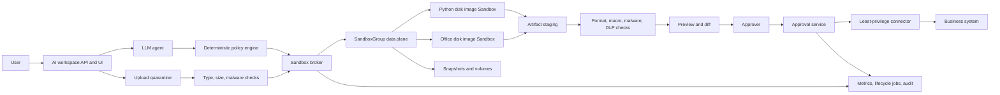

# Azure Container Apps Sandboxes 참조 Architecture

## 범위

이 Reference Architecture는 Azure Container Apps Sandboxes 기반 AI
Workspace를 설명한다. Application이 각 Sandbox lifecycle을 관리하고
suspend, snapshot 및 volume 기능으로 workspace state를 보존할 수 있으며,
실행, file, network policy 및 identifier는 Backend Broker 뒤에 숨긴다.

관련 실습:

- [실습 3: ACA Sandboxes index](../../labs/aca-sandboxes/03_ACA_Sandboxes_Lab.md)
- [실습 3A: Python 관리자](../../labs/aca-sandboxes/03A_ACA_Sandboxes_Admin_Lab.md)
- [실습 3B: Python 사용자 흐름](../../labs/aca-sandboxes/03B_ACA_Sandboxes_User_Lab.md)
- [실습 3C: Office 관리자](../../labs/aca-sandboxes/03C_ACA_Sandboxes_Office_Admin_Lab.md)
- [실습 3D: Office 사용자 흐름](../../labs/aca-sandboxes/03D_ACA_Sandboxes_Office_User_Lab.md)

> ACA Sandboxes는 Preview 서비스다. SDK와 API version을 고정하고 리소스
> 재생성 runbook을 유지하며, 이전 Preview release에서 만든 리소스를
> regression test한다.

## 설계 목표

- User, Agent 또는 task별로 격리된 VM boundary를 제공한다.
- Sandbox, image, snapshot, volume 및 secret ID를 server에만 보관한다.
- Outbound traffic을 기본 거부하고 좁고 만료 가능한 예외만 허용한다.
- Product 경험에 필요한 경우에만 state를 보존한다.
- Artifact를 검사하고 staging한 뒤 승인과 승격을 수행한다.
- Idle workload를 auto-suspend하고 만료된 workload와 orphan state를 삭제한다.
- Tenant concurrency, resource tier, lifetime, storage 및 retry를 제한한다.

## 논리 Architecture



Broker는 Sandbox를 생성하고 승인된 resource tier와 disk image를 선택하며,
network 및 lifecycle policy를 적용한다. 또한 file I/O, `exec`, suspend,
resume, snapshot 및 delete를 관리한다. 사용자가 Sandbox ID를 authorization
경계로 선택하게 하지 않는다.

## Resource Model 설계

`Microsoft.App/SandboxGroups`는 Sandbox, disk image, snapshot, volume 및
secret의 management boundary다. Application은 tenant, user, conversation,
request, Sandbox ID, image release, resource tier, state policy, expiry 및
last activity를 포함한 owner record를 durable storage에 유지해야 한다.

관측된 resource tier:

| 리소스 Tier | vCPU | Memory | Local disk 용량 |
| --- | ---: | ---: | ---: |
| XS | 0.25 | 0.5 GB | 20 GB |
| S | 0.5 | 1 GB | 20 GB |
| M | 1 | 2 GB | 20 GB |
| L | 2 | 4 GB | 40 GB |
| XL | 4 | 8 GB | 80 GB |

측정된 latency와 memory 요구를 충족하는 가장 작은 tier로 시작한다. 허용
tier는 policy로 강제하고 user input으로 제한 없는 tier를 선택하지 못하게 한다.

## Disk Image와 실행

승인된 OCI image를 Sandbox disk image로 변환한다. Source registry,
immutable tag, source digest, disk image ID, 생성 시각, SDK/API version,
SBOM, scan 결과 및 release label을 기록한다. 새 OCI tag는 기존 disk
image를 갱신하지 않는다. 새 disk image를 만들고 canary 검증을 완료한 후
Broker의 release selector를 변경한다.

권장 image:

- 필요한 package를 고정한 Python 분석 image
- LibreOffice, Pandoc, Poppler, font 및 문서 library를 포함한 Office image

`exec`는 typed application operation을 통해서만 호출한다. Python 요청은
deterministic policy, timeout, retry ceiling 및 artifact requirement로
제한한다. Office는 선언적 generate, convert 및 edit schema를 노출하고,
user 또는 model이 임의 shell command나 LibreOffice argument를 전달하지
못하게 한다.

Reference Python Orchestrator는 다음 application 설정으로 `exec` request를
최대 900초로 제한한다.

```bash
export ACA_EXECUTION_TIMEOUT_SECONDS="${ACA_EXECUTION_TIMEOUT_SECONDS:-900}"
```

이는 platform 보장값이 아니라 **reference application limit**이다. 더 긴
batch 작업은 별도 governance를 적용한 compute 경로로 routing한다. 값을
늘릴 때는 policy, 비용, cancellation 및 cleanup 통제를 함께 강화한다.

## State와 Lifecycle

Workload별로 다음 세 product policy 중 하나를 정의한다.

| Policy | 용도 | 완료 시 동작 |
| --- | --- | --- |
| Ephemeral | 일회성 분석 또는 문서 생성 | Artifact staging 후 삭제 |
| Resumable | Idle 시간이 제한된 multi-turn workspace | Auto-suspend 후 authorized request에서 resume |
| Checkpointed | 명시적 복구 또는 handoff 지점 | Named snapshot 생성 후 suspend 또는 delete |

Lifecycle metadata에는 `created_at`, `last_active_at`, `idle_deadline`,
`delete_after`, owner 및 data retention classification을 포함한다.
Scheduled reconciler는 platform inventory와 owner database를 비교해 다음을
수행한다.

- Idle running Sandbox를 suspend한다.
- 만료된 Sandbox를 삭제한다.
- Retention을 지난 snapshot과 disk image를 삭제한다.
- Data policy에 따라 만료된 volume을 detach 또는 delete한다.
- 알 수 없는 리소스는 즉시 삭제하지 않고 quarantine한다.
- 반복되는 cleanup 실패에 alert를 발생시킨다.

Memory suspend는 memory와 disk를 보존해 가장 빠르게 resume하지만 저장
footprint가 커진다. Disk suspend는 disk만 보존하고 process는 resume 시
다시 시작한다. Resume SLO, data sensitivity 및 storage budget을 기준으로
mode를 선택한다.

## Snapshot 관리

Snapshot은 독립 lifecycle object이며 source Sandbox를 삭제한 후에도 남을 수
있다. Request마다 암묵적으로 생성하지 않고 명시적인 checkpoint에만 사용한다.

필수 snapshot metadata:

- Tenant와 owner
- Source Sandbox와 image release
- 생성 사유와 approval record
- 생성 및 만료 시각
- Data classification과 encryption requirement
- Restore test 상태

Snapshot은 region에 종속된다. Disaster recovery는 cross-region snapshot
restore를 가정하지 않고 재현 가능한 image와 외부 저장된 승인 artifact를
기준으로 설계한다. 정기적으로 canary snapshot을 restore해 file, process,
network policy 및 ownership을 검증한다.

## Volume 설계

Azure Blob volume은 multi-attach를 지원하고 Data Disk volume은
single-attach다. Consistency, 공유, throughput 및 tenant isolation 요구에
따라 volume type을 선택한다.

Volume 통제:

- 명시적으로 승인된 shared workspace가 아니면 tenant 간 volume을 공유하지
  않는다.
- Mount authorization을 server-side owner record에 binding한다.
- Data를 encrypt하고 storage-plane identity를 제한한다.
- Workspace별 path와 server가 만든 안전한 filename을 사용한다.
- Import content는 실행 전에, export content는 승격 전에 검사한다.
- Detach, retention, orphan detection 및 deletion 동작을 정의한다.
- Provisioned size, used byte, attachment state 및 age를 monitoring한다.

Local disk, snapshot 또는 volume을 승인된 업무 record로 취급하지 않는다.
승격은 항상 staging, 검사, approval 및 별도 Connector를 거친다.

## Network 설계

`default_action='Deny'`와 full traffic inspection을 사용한다. Outbound access는
policy가 생성한 domain, CIDR, protocol, port 및 method rule로만 허용한다.
각 예외에는 business reason, owner, tenant, request ID 및 expiry를 기록한다.

Private endpoint, 중앙 DNS, firewall routing 또는 network inspection이
필요하면 VNet integration을 사용한다. Product scenario에 ingress port가
명시적으로 필요한 경우가 아니면 ingress를 닫는다. Port를 열 때는 application
layer에서 인증하고 source와 lifetime을 제한한다.

Destination이 allowlist에 있더라도 production credential을 Sandbox에
주입하지 않는다. Business system과 중요 data에는 backend-mediated access를
우선한다.

## Identity와 보안

`Container Apps SandboxGroup Data Owner`를 Broker identity에 필요한 최소
SandboxGroup 또는 Resource Group scope로 부여한다. Deployment, runtime
Broker, registry, storage 및 production Connector identity를 분리한다.

| 위협 | 필수 통제 |
| --- | --- |
| Sandbox ID 노출 | Backend-only ID, prompt·client response·user-visible log에서 제외 |
| Tenant 간 접근 | 매 exec, file, lifecycle, snapshot, volume 호출 전 owner authorization |
| 악성 코드 | 격리 VM, 기본 egress 거부, tier 및 timeout limit, production credential 미주입 |
| 악성 artifact | Quarantine, MIME 및 magic byte 검사, malware/DLP, macro 및 archive 통제 |
| Snapshot data 잔존 | Classification, encryption, retention, 명시적 delete, orphan reconciliation |
| Volume data 유출 | Tenant-bound mount, 최소 권한 storage identity, attachment audit |
| 공급망 공격 | Private registry, immutable digest, scan, SBOM, canary disk image |
| 승인 우회 | External Approval Service만 production Connector 호출 |
| 비용 고갈 | Tenant concurrency, max tier, idle suspend, delete deadline, budget alert |

Preview registry 인증 동작은 고정된 SDK에서 검증한다. Disk image 등록에
short-lived registry credential이 필요하면 memory에만 보관하고 file이나
log에 기록하지 않는다. Service version에서 Managed Identity를 안정적으로
지원하면 해당 방식으로 전환한다.

## File과 Approval 흐름

1. 입력을 quarantine에서 받는다.
2. 실제 형식, 크기, archive 속성, malware 상태 및 tenant를 확인한다.
3. 허용된 file을 tenant 소유 Sandbox workspace에 쓴다.
4. 고정된 resource와 time limit으로 승인된 typed operation을 실행한다.
5. 생성 artifact를 immutable staging으로 읽는다.
6. Filename, MIME, magic byte, macro 상태, 크기 및 SHA-256을 확인한다.
7. 안전한 preview 또는 Diff를 rendering한다.
8. 명시적 approval을 요구한다.
9. Hash를 다시 확인하고 별도 Connector가 정확한 artifact만 승격한다.
10. Workload의 delete 또는 suspend policy를 적용한다.

Retry가 통제되지 않은 중복 Sandbox를 만들지 않게 한다. Idempotency key를
사용하고 platform operation 시작 전에 creation intent를 저장한다.

## Performance 측정

지원 조건에서 platform allocation과 memory resume은 subsecond일 수 있지만,
사용자 관점 SLO에는 다음을 모두 포함한다.

- Broker 및 SDK latency
- Disk image 선택과 boot
- Application 초기화
- File 및 volume staging
- Command 실행
- Artifact download와 검사
- Suspend, resume 및 cleanup

Region, image 및 tier별 create, first exec, warm exec, memory resume, disk
resume, delete의 p50/p95/p99를 측정한다. Burst 동작, downstream rate limit,
SandboxGroup quota 및 owner database contention을 load test한다. 더 큰 tier는
줄어든 duration 또는 개선된 SLO가 높은 실행 비용을 상쇄할 때만 사용한다.

## 비용

현재 Preview pricing model에서 running compute는 vCPU와 memory 사용 시간을
초 단위로 과금한다. Stop 또는 suspend된 Sandbox는 CPU와 memory compute
비용이 없지만 snapshot, volume, registry image, logging, networking 및
관련 Azure resource 비용은 계속 발생할 수 있다.

비용 통제:

- 작은 tier를 기본값으로 사용하고 max tier를 강제한다.
- 짧은 초기 idle threshold로 auto-suspend한 뒤 측정된 resume latency에
  따라 조정한다.
- 다시 사용하지 않을 workspace는 삭제한다.
- Snapshot 및 volume TTL을 설정한다.
- 교체된 disk image와 registry tag를 garbage collection한다.
- Tenant concurrency와 일일 create 수를 제한한다.
- Running, idle, suspended 및 orphan count에 alert를 설정한다.
- Tier별 runtime second와 snapshot/volume byte를 추적한다.
- 사용하지 않는 실습 Resource Group 전체를 삭제한다.

Production 승인 전 현재 regional price와 Preview meter를 확인한다.

## Monitoring과 운영

다음 항목을 correlation한다.

```text
tenant_id -> request_id -> sandbox_group -> sandbox_id -> image_release
          -> snapshot_or_volume -> execution_id -> artifact_hash
          -> approval_id -> connector_result
```

운영 dashboard:

- Running, idle, suspended, failed, deleting 상태별 Sandbox 수
- Create, exec, resume, suspend, delete latency 측정
- SDK/API version과 image release별 failure 및 retry rate
- Tenant와 tier별 Sandbox 수 및 runtime
- Snapshot과 volume 수, byte, age 및 owner 상태
- Network deny와 만료 예정 예외
- Artifact validation 및 hash failure
- Orphan age와 cleanup backlog
- 일일 비용과 forecast

Runbook은 create 실패, 멈춘 lifecycle operation, owner record 유실, image
regression, SDK/API incompatibility, snapshot restore 실패, volume attachment
conflict, network policy 오류 및 긴급 강제 삭제를 다룬다.

## Production 점검표

- [ ] 지원 region, quota 및 고정된 Preview version 확인
- [ ] Broker 범위 SandboxGroup Data Owner role
- [ ] 모든 리소스의 durable tenant 및 owner mapping
- [ ] 기본 egress 거부와 만료 가능한 allow rule
- [ ] 승인된 resource tier와 max lifetime
- [ ] Immutable, scan 완료, 재현 가능한 disk image
- [ ] Typed Python 및 Office operation contract
- [ ] Upload quarantine과 artifact 검사
- [ ] External Approval Service와 최소 권한 Connector
- [ ] Auto-suspend, delete deadline 및 restart-safe reconciliation
- [ ] Snapshot 및 volume retention과 orphan cleanup
- [ ] Idempotent create와 retry 처리
- [ ] Create, resume, cleanup, storage 및 비용 alert
- [ ] Snapshot restore와 image recreation test
- [ ] Image와 외부 승인 artifact 기반 region recovery

## 공식 문서

- [ACA Sandboxes 개요](https://learn.microsoft.com/azure/container-apps/sandboxes-overview)
- [Snapshot과 State 관리](https://learn.microsoft.com/azure/container-apps/sandboxes-snapshots-state-management)
- [ACA Sandboxes 개발 문서](https://sandboxes.azure.com/docs/sandboxes/)
- [ACA Sandboxes Portal 열기](https://sandboxes.azure.com/)
