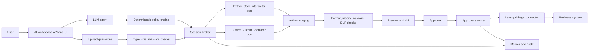

# Azure Container Apps Dynamic Sessions 참조 Architecture

## 범위

이 Reference Architecture는 AI Workspace가 Azure Container Apps Dynamic
Sessions에서 신뢰할 수 없는 Python 및 문서 처리 workload를 실행하는 구조를
설명한다. Python Code Interpreter와 Custom Container Session Pool을 다루며,
managed session 경계 외부에 deterministic policy, artifact 검사, 승인 및
정리 절차를 둔다.

관련 실습:

- [실습 1: Python Code Interpreter](../../labs/dynamic-sessions/01_Python_Code_Interpreter_Lab.md)
- [실습 1A: Python 관리자](../../labs/dynamic-sessions/01A_Python_Code_Interpreter_Admin_Lab.md)
- [실습 1B: Python 사용자 흐름](../../labs/dynamic-sessions/01B_Python_Code_Interpreter_User_Lab.md)
- [실습 2: Office Custom Container](../../labs/dynamic-sessions/02_Office_Custom_Container_Lab.md)
- [실습 2A: Office 관리자](../../labs/dynamic-sessions/02A_Office_Custom_Container_Admin_Lab.md)
- [실습 2B: Office 사용자 흐름](../../labs/dynamic-sessions/02B_Office_Custom_Container_User_Lab.md)

## 설계 목표

- 요청 또는 대화별로 코드와 파일을 격리한다.
- Session identifier, endpoint, token 및 credential은 server에서만 관리한다.
- Outbound access를 기본 거부한다.
- 실행 시간, memory, concurrency, retry 및 artifact 크기를 제한한다.
- Preview 또는 승격 전에 모든 artifact를 검사한다.
- 별도 Connector가 업무 시스템을 변경하기 전에 명시적으로 승인한다.
- 성공, 실패 및 취소 모두에서 session과 임시 파일을 삭제한다.

## 논리 Architecture



Agent는 작업을 제안하지만 network, pool, limit, credential 또는 승격 policy를
선택하지 않는다. 가능한 경우 Policy Engine을 model 호출보다 먼저 실행해,
거부된 요청이 model token이나 session capacity를 사용하지 않게 한다.

## 실행 경로

### Python Code Interpreter

짧은 분석, 계산, chart 및 파일 생성 요청에는 managed Python runtime을
사용한다. Backend는 Entra token과 예측 불가능한 `identifier`로 Pool
management endpoint를 호출한 뒤 execution, file 및 session API를 사용한다.

2026년 7월에 확인한 runtime 정보는 과거 검증 근거이며 영구적인 platform
계약이 아니다. 당시 PythonLTS image에는 Python 3.12.7, pandas, NumPy,
matplotlib, SciPy, scikit-learn, statsmodels, SymPy, NetworkX, python-docx,
python-pptx, openpyxl, XlsxWriter, ReportLab, Pillow, lxml, Beautiful Soup 및
PyArrow가 포함돼 있었다. Managed image는 변경될 수 있으므로 필요한 package
목록을 regression test로 확인한다.

Interpreter 내부 코드는 Python process와 operating system API를 호출할 수
있다. 따라서 static source scanning은 보조 통제일 뿐이다. 주 통제는 isolation,
egress 차단, production credential 미주입, resource limit 및 session 외부의
승인 경계다.

### Office Custom Container

LibreOffice, Pandoc, Poppler, 고정 font 또는 고정된 tool version이 필요하면
Custom Container Pool을 사용한다. Image는 다음 기준을 따른다.

- Non-root user로 실행한다.
- `/health`, `/generate`, `/convert`, `/edit` 및 통제된 file download만
  제공하는 좁은 HTTP API를 노출한다.
- Command 또는 shell argument 대신 선언적 operation을 받는다.
- Startup 및 Liveness probe를 정의한다.
- Dependency와 font를 image에 포함한다.
- Immutable tag, digest, SBOM 및 tool version을 기록한다.

Reference Office API는 알려진 생성 형식, 명시적 conversion matrix 및 선언적
DOCX, PPTX, XLSX 편집만 허용한다. 임의 executable, shell command, 명시적으로
허용하지 않은 formula, macro, external template, remote media, 임의 local
path 및 승인되지 않은 source-target 변환은 거부한다.

## Session Broker 구성

Broker는 Pool endpoint와 session identifier를 아는 유일한 component다.

- `https://dynamicsessions.io` audience의 token을 가져온다.
- Identifier에 최소 128-bit entropy를 사용한다.
- Tenant, user, conversation, request, pool, identifier 및 execution ID를
  mapping한다.
- Tenant별 concurrency, request quota, timeout, retry 및 artifact limit을
  강제한다.
- Agent에게 반환하기 전에 오류를 sanitize한다.
- Execution, staging, approval 및 cleanup에 correlation ID를 연결한다.
- 일회성 작업에는 항상 delete 또는 stop을 호출한다.

User ID로 identifier를 직접 만들거나 client가 제출한 identifier를
authorization 경계로 사용하지 않는다.

## Trust Boundary와 보안

| 경계 또는 위협 | 필수 통제 |
| --- | --- |
| 사용자 입력과 Workspace | 인증, tenant binding, request limit, prompt injection 대응 |
| Workspace와 Pool | Managed Identity, HTTPS, Pool 범위 Session Executor role |
| Identifier 노출 | Backend-only 보관, 사용자 URL·prompt·client log에서 제외 |
| 악성 코드 | Hyper-V isolation, egress 차단, timeout, memory 및 concurrency limit |
| 악성 파일 | Quarantine, magic byte 및 MIME 검사, malware scan, archive limit |
| Credential 탈취 | Production secret 또는 Connector credential 미주입 |
| Tenant 간 접근 | Server-side tenant-identifier mapping과 매 요청 authorization |
| Artifact 변조 | Staging 시점과 승격 직전 SHA-256 검증 |
| 승인 우회 | Approval Service만 production Connector 호출 |
| 공급망 공격 | Private registry, immutable image tag, digest, scan, SBOM |
| 비용 고갈 | Tenant quota, max session, retry ceiling, budget alert |

Deployment identity와 runtime identity를 분리한다. `Azure ContainerApps
Session Executor`는 필요한 Pool scope에만 부여한다. Private Office image에는
전용 pull identity와 `AcrPull`을 사용하고 runtime resource identity로
재사용하지 않는다.

## Network 설계

기본 Pool network status를 `EgressDisabled`로 설정한다. 실행 중 package를
설치하거나 사용자가 선택한 URL을 가져오지 않는다. Dependency는 managed
runtime 또는 custom image에 포함한다.

통제된 outbound access가 필요하면 workload-profiles Environment와 VNet을
사용하는 별도 Custom Container 경로를 만든다. Explicit firewall policy로
traffic을 전달하고 DNS 및 egress 결정을 기록하며, 각 예외에 owner와 만료를
지정한다. Backend가 allowlist object를 다운로드하고 검사한 뒤 session file로
전달하는 brokered fetch도 안전한 방식이다.

## File 및 Artifact Lifecycle

1. Upload를 quarantine에서 받는다.
2. 선언 형식과 실제 형식, 크기, archive depth 및 malware 상태를 검사한다.
3. 허용된 입력만 할당된 session에 복사한다.
4. 고정된 limit으로 실행하고 status, `stdout`, `stderr`, duration 및 생성
   file을 수집한다.
5. 출력을 tenant 범위 staging으로 복사한다.
6. File name, magic byte, MIME type, size, macro 상태 및 SHA-256을 검증한다.
7. 안전한 preview 또는 Diff를 생성한다.
8. User 또는 approver의 명시적 승인을 요구한다.
9. Hash를 다시 계산하고 별도 최소 권한 Connector가 정확한 staged artifact만
   승격한다.
10. Session을 삭제하고 승인되지 않은 staging data를 만료 처리한다.

Session은 임시 workspace이며 durable storage 또는 backup이 아니다.

## 오류와 Retry

Transport retry와 code retry를 분리한다. 429와 일시적 5xx에는 제한된
exponential backoff를 적용한다. 생성 코드가 실패하면 다음 절차를 따른다.

1. Sanitized되고 크기가 제한된 진단 정보만 Agent에 반환한다.
2. Code hash가 변경돼야 다시 실행한다.
3. 기본적으로 수정 시도를 최대 두 번 허용한다.
4. 동일 오류, timeout, policy violation 또는 필수 artifact 누락 시 중단한다.

Execution은 HTTP 200을 반환하면서 platform status가 `Failed`일 수 있다.
반대로 성공한 실행도 warning을 `stderr`에 기록할 수 있다. 성공 여부는
platform execution status로 판단한다.

## Lifecycle, capacity, performance 및 비용

Timed lifecycle과 사용자 경험에 맞는 가장 짧은 cooldown을 사용한다.
일회성 Python 작업 후 session을 삭제하고, Custom Container 작업이 끝나면
session을 stop한다. Cleanup은 `finally` 경로에서 수행하며 취소와 process
restart 복구도 포함한다.

Capacity planning에서 다음을 추적한다.

- Allocation p50, p95, p99 측정
- Pending, ready, executing session 수
- File transfer, image initialization, application startup을 포함한 end-to-end
  latency 측정
- Execution timeout 및 retry rate
- Cleanup delay와 orphan identifier
- Artifact 검사 및 approval latency

2026년 7월 관측 기준 Code Interpreter limit은 execution당 220초, upload
file당 128MB였다. Memory는 제한돼 있다고 가정하되 문서화되지 않은 고정값에
의존하지 않는다. 더 크거나 오래 실행되는 작업은 별도 asynchronous compute
경로로 routing한다.

과금 방식은 Pool type에 따라 다르다. Code Interpreter의 allocated session
시간은 1시간 단위로 문서화됐고, Custom Container capacity는 active 및 ready
session을 수용하는 dedicated node를 사용했다. 불필요한 ready capacity를
줄이고 Pool `nodeCount`와 max session을 관찰하며 배포 시점의 regional
meter를 확인한다.

## Monitoring과 운영

다음 항목을 correlation한다.

```text
tenant_id -> request_id -> plan_id -> pool_name -> identifier
          -> execution_id -> artifact_hash -> approval_id -> connector_result
```

Policy 결정, allocation latency, execution status, 제한된 output, artifact
검사 결과, approval event, Connector 결과 및 cleanup outcome을 수집한다.
Token, 원본 민감 파일 또는 session identifier를 사용자에게 보이는 log에
기록하지 않는다.

권장 alert:

- Pending session이 지속적으로 0보다 큼
- Ready session이 필요한 baseline 아래로 감소
- Timeout, retry exhaustion 또는 5xx rate가 baseline의 두 배로 증가
- Artifact validation 또는 hash 검증 실패
- Approval record 없는 Connector 호출
- Session cleanup이 예상 시간을 초과
- Ready capacity 또는 일일 비용이 budget 초과

Custom Container 진단에서는 실제 Log Analytics table 이름을 workspace에서
확인한다. Preview version 동안 lifecycle 및 pool event table 이름이 변경된
적이 있다. Console log 외 항목에는 Environment diagnostic setting이 필요하다.

## Production 점검표

- [ ] 지원 region 및 quota 확인
- [ ] Pool 범위 runtime RBAC와 별도 deployment identity
- [ ] 기본 `EgressDisabled`
- [ ] Backend-only identifier 및 token
- [ ] Tenant concurrency, timeout, retry 및 size limit
- [ ] Non-root, scan 완료, digest 고정 custom image
- [ ] Startup 및 Liveness probe
- [ ] Upload quarantine과 artifact malware/DLP 통제
- [ ] Immutable staging과 hash 재검증
- [ ] 명시적 approval과 별도 Connector identity
- [ ] 성공, 실패, 취소 및 restart 시 cleanup
- [ ] Allocation, execution, cleanup 및 비용 alert
- [ ] Runtime package와 문서 fidelity regression test
- [ ] Interpreter limit 초과 작업의 대체 경로

## 공식 문서

- [Dynamic Sessions 개요](https://learn.microsoft.com/azure/container-apps/sessions)
- [Dynamic Sessions 사용, 보안 및 인증](https://learn.microsoft.com/azure/container-apps/sessions-usage)
- [Code Interpreter Session 문서](https://learn.microsoft.com/azure/container-apps/sessions-code-interpreter)
- [Custom Container Session 문서](https://learn.microsoft.com/azure/container-apps/sessions-custom-container)
- [Session Pool 구성](https://learn.microsoft.com/azure/container-apps/session-pool)
- [Dynamic Sessions 과금](https://learn.microsoft.com/azure/container-apps/billing#dynamic-sessions)
